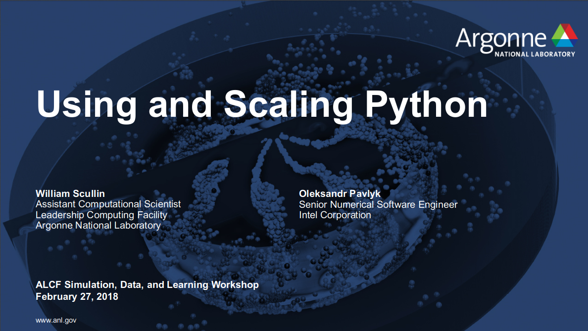

[Full list of Python Materials]({{site.baseurl}}/python-for-hpc/)

## In the Spotlight ...

### Featured Webinar:

***Jupyter and HPC: Current State and Future Roadmap***  
*IDEAS Webinar Series 2018, Matthias Bussonnier, Shreyas Cholia, Suhas Somnath*

<iframe width="280" height="157" src="https://www.youtube.com/embed/aKah_O5OZdE" frameborder="0" allow="autoplay; encrypted-media" allowfullscreen></iframe> 

 - [Webinar Page](https://www.exascaleproject.org/event/jupyter/){:target="_blank"}
 - [Jupyter in HPC Links]({{site.baseurl}}/python-for-hpc/#jupyter-notebooks){:target="_blank"}

---

### Featured Presentation:

***Using and Scaling Python***  
*ALCF Simulation, Data, and Learning Workshop 2018. William Scullin (ALCF) and Oleksandr Pavlyk (Intel)*

{:target="_blank"}

 
<!--<iframe width="280" height="157" src="https://www.youtube.com/embed/14rbhkrRxUs" frameborder="0" allow="autoplay; encrypted-media" allowfullscreen></iframe>-->

---

### Featured Video:

***Python in HPC***  
*IDEAS Webinar Series 2017, Rollin Thomas, NERSC; William Scullin, ANL; Matt Belhorn, ORNL*

<iframe width="280" height="157" src="https://www.youtube.com/embed/lSrfZHu3BZw" frameborder="0" allow="autoplay; encrypted-media" allowfullscreen></iframe> 

 - [Webinar Page](https://www.exascaleproject.org/event/python-in-hpc-2){:target="_blank"}

---

### Featured Event:

***SciPy 2019***  
*Austin, Texas, July 8-14th*

{:target="_blank"}

The annual SciPy Conference brings together over 800 participants from industry, academia, and government to showcase their latest projects, learn from skilled users and developers, and collaborate on code development.

---

### Feedback

Any feedback, corrections, and suggested additions are welcome: shudson@anl.gov.
Join the Slack page or raise a github [issue](https://github.com/betterscientificsoftware/python-for-hpc/issues) in this repository (esp. broken links etc).

If this page was useful you can provide a Star on github:
<iframe src="https://ghbtns.com/github-btn.html?user=betterscientificsoftware&repo=python-for-hpc&type=star&count=false&size=large" frameborder="0" scrolling="0" width="160px" height="30px"></iframe>

<!--<iframe width="560" height="315" src="https://www.youtube.com/embed/14rbhkrRxUs" frameborder="0" allow="autoplay; encrypted-media" allowfullscreen></iframe>
<iframe width="560" height="315" src="https://www.youtube.com/embed/aKah_O5OZdE" frameborder="0" allow="autoplay; encrypted-media" allowfullscreen></iframe> -->
